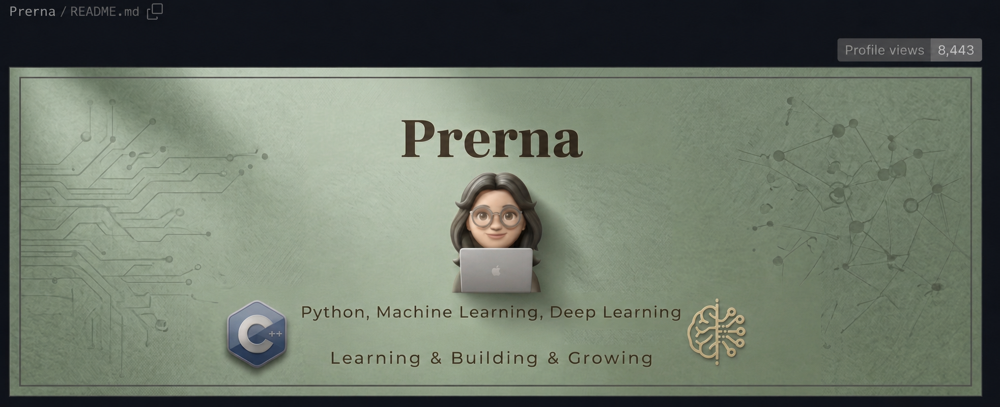

<!-- Profile README for github.com/Prerna-1416 -->

  

  

 

  
  
  
<b>L E A R N I N G &nbsp; &amp; &nbsp; M A K I N G &nbsp; M E A N I N G F U L &nbsp; T H I N G S</b>

---

## 🌻 A little about me

I enjoy turning real-world problems into usable digital experiences — especially where AI, agriculture, and accessible product design meet. I’m learning in public, experimenting generously, and building with equal parts curiosity and care.

  
  

## Projects I care about

  A small collection of things I’m learning, building, and exploring.

<table>
  <tr>
    <td colspan="3" valign="top">
      <h3 align="center">All repositories</h3>
      
<i>A growing collection of experiments and ideas.</i>

    </td>
  </tr>
  <tr>
    <td width="33%" align="center"><a href="https://github.com/Prerna-1416/spurti"><b>SPURTI</b> Explore →</a></td>
    <td width="33%" align="center"><a href="https://github.com/Prerna-1416/suryakavach"><b>Suryakavach</b> Explore →</a></td>
    <td width="33%" align="center"><a href="https://github.com/Prerna-1416/sugarcane_AI"><b>CaneGuard AI</b> Explore →</a></td>
  </tr>
  <tr>
    <td align="center"><a href="https://github.com/Prerna-1416/Kisan-Saathi-Platform"><b>Kisan Saathi</b> Explore →</a></td>
    <td align="center"><a href="https://github.com/Prerna-1416/KitchenGPT"><b>KitchenGPT</b> Explore →</a></td>
    <td align="center"><a href="https://github.com/Prerna-1416/Verifin_AI"><b>Verifin AI</b> Explore →</a></td>
  </tr>
  <tr>
    <td align="center"><a href="https://github.com/Prerna-1416/FlowZint-Ai-Support-Bot-"><b>FlowZint AI Bot</b> Explore →</a></td>
    <td align="center"><a href="https://github.com/Prerna-1416/-CaneGuard-AI-Sugarcane-Disease-Detection"><b>Disease Detection</b> Explore →</a></td>
    <td align="center"><a href="https://github.com/Prerna-1416/theme-and-font-customizer"><b>Theme Customizer</b> Explore →</a></td>
  </tr>
  <tr>
    <td align="center"><a href="https://github.com/Prerna-1416/-prerna-blog"><b>Prerna Blog</b> Explore →</a></td>
    <td align="center"><a href="https://github.com/Prerna-1416/FAQ_software"><b>FAQ Software</b> Explore →</a></td>
    <td align="center"><a href="https://github.com/Prerna-1416/winner"><b>Winner</b> Explore →</a></td>
  </tr>
  <tr>
    <td colspan="3" valign="top">
      <h3 align="center">Projects I care about</h3>
      
 &nbsp; <i>A few ideas I’m growing with care.</i>

    </td>
  </tr>
  <tr>
    <td align="center"><a href="https://github.com/Prerna-1416/spurti"><b>SPURTI</b> Explore →</a></td>
    <td align="center"><a href="https://github.com/Prerna-1416/suryakavach"><b>Suryakavach</b> Explore →</a></td>
    <td align="center"><a href="https://github.com/Prerna-1416/sugarcane_AI"><b>CaneGuard AI</b> Explore →</a></td>
  </tr>
  <tr>
    <td colspan="3" align="center">🌻 &nbsp; ✦ &nbsp; 💻</td>
  </tr>
</table>

## 🧰 My toolkit

  

## 📈 My GitHub rhythm

  

## ✉️ Let’s connect

  

<!-- Add a verified LinkedIn link here when ready. -->
<!-- Add a public contact email here when ready. -->

  Made with curiosity, warm yellow energy, and a little blue-heart magic. 💙

## 🐍 Contribution quest

  

